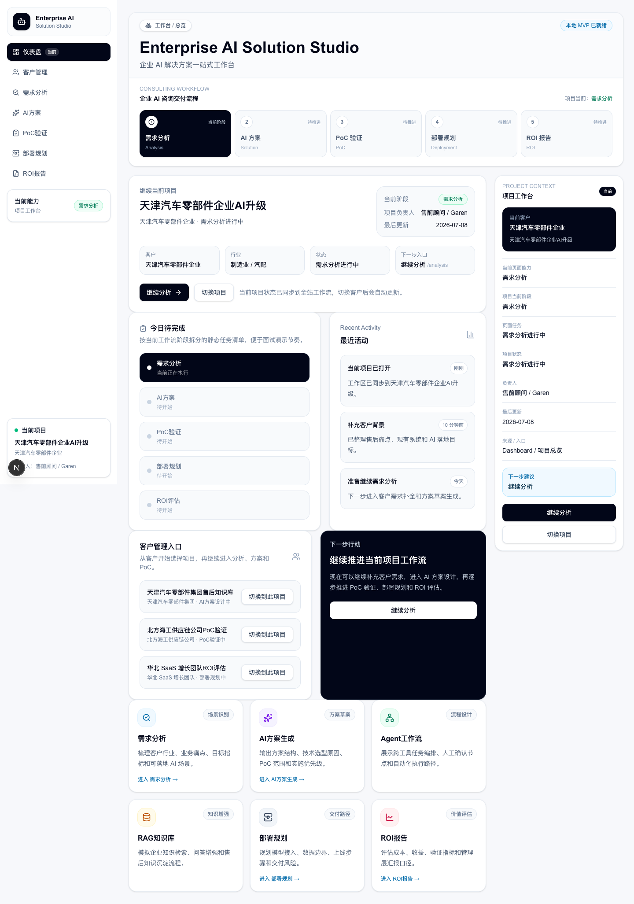
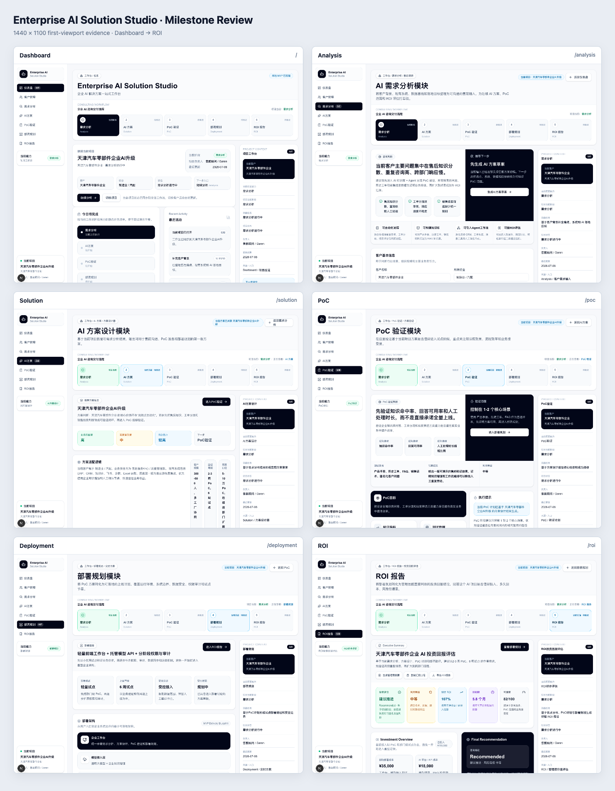
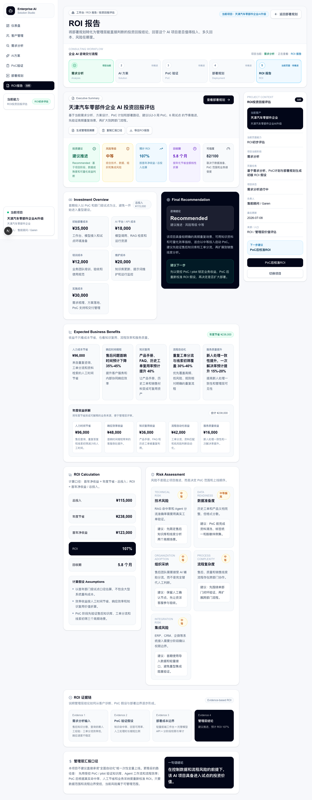

# Enterprise AI Solution Studio

**企业 AI 解决方案工作台**：一个面向 AI 解决方案顾问、AI 售前和 AI 实施岗位的
interview-ready 企业 SaaS MVP。

它不是普通 Chatbot，而是把企业 AI 项目的前期咨询与交付过程组织成一条可演示链路：

```text
客户与项目
  -> 需求分析
  -> AI 方案设计
  -> PoC 验证
  -> 部署规划
  -> ROI 评估
```

## Live Demo

- [中国大陆主站](https://enterprise-ai-studio-282223-9-1444381545.sh.run.tcloudbase.com)
- [核心需求分析页](https://enterprise-ai-studio-282223-9-1444381545.sh.run.tcloudbase.com/analysis)
- [公开源码](https://github.com/WalDesigner/enterprise-ai-solution-studio)

国内主站运行在 Tencent CloudBase Run，并通过 ModelScope 提供真实 AI 方案草案生成。
这是当前唯一推荐用于简历和面试的公开入口。当前线上版本、验收和回滚以
[部署与运维交接](docs/DEPLOYMENT_HANDOFF.md)为准。

## 产品截图

### Dashboard / 项目工作台



### Workflow / 企业 AI 咨询流程



### ROI / 投资回报评估



> 截图用于快速了解主要模块；最新交互体验以 Live Demo 为准。

## 为什么做这个项目

目标不是证明“会做几个页面”，而是证明能够：

- 从客户、业务场景和目标指标开始理解企业 AI 需求。
- 把模糊需求拆解为方案、PoC、部署与 ROI 交付物。
- 解释 RAG、Agent、模型、人工确认和安全边界为什么这样设计。
- 用真实 AI、失败降级、容器部署和质量验证完成公开演示闭环。
- 清楚区分真实能力、脱敏案例数据、静态咨询内容和 Mock fallback。

## 核心模块

| 模块 | 作用 | 主要产出 |
| --- | --- | --- |
| Dashboard | 了解当前客户、项目、阶段和下一步 | 项目总览与行动入口 |
| Customers | 选择脱敏客户案例和项目 | 共享客户 / 项目上下文 |
| Analysis | 结构化客户背景、痛点、系统、数据和目标 | 真实 AI / Mock 方案草案 |
| Solution | 组织模型、RAG、Agent、工作流和部署建议 | 售前方案框架 |
| PoC | 定义验证目标、数据、指标、风险和门槛 | PoC 验证计划 |
| Deployment | 规划架构、安全、权限、阶段和交付控制 | 部署蓝图 |
| ROI | 把技术方案转成投入、收益和风险语言 | 管理层投资建议 |

## Real AI Vertical Slice

当前真实 AI 聚焦在 Analysis：

```text
Analysis form
  -> POST /api/analysis/generate
  -> server-side AI Provider Adapter
  -> ModelScope / OpenRouter / Gemini / Groq / OpenAI
  -> structured consulting draft
  -> honest Mock fallback on failure
```

实现包含：

- 服务端环境变量读取，浏览器不接触 Provider Key。
- 50,000 bytes 请求体限制和单实例轻量限流。
- 30 秒 Provider 总超时。
- ModelScope 瞬时错误受限重试，最多两次总尝试。
- 严格 JSON、字段变体、thinking block、代码围栏和六段 Markdown 容错解析。
- `source`、`provider`、`errorCategory` 诊断字段，明确 Real AI 与 fallback。

## 状态与数据边界

- `lib/current-project.ts` 提供 4 个脱敏项目案例。
- 当前项目、Analysis 表单和生成草案按项目保存在浏览器 `localStorage`。
- Solution 会读取当前项目最近一次 Analysis 草案。
- 浏览器存储损坏时会安全回退到默认案例。
- 没有数据库、登录或跨设备同步。

真实部分：

- Next.js 页面、路由、交互与共享工作区。
- Analysis 服务端 AI 调用、结构化解析与 Mock fallback。
- 浏览器本地持久化、移动端适配和自动化验证。
- CloudBase 国内容器部署与 ModelScope 真实 AI 公网验收。

演示 / 静态部分：

- 客户、项目和业务数据。
- PoC 测试结果与 ROI 假设。
- RAG 检索、Agent 后台执行和企业系统集成。
- 认证、多租户、数据库、监控告警和生产 SLA。

## 技术栈

- Next.js 16 App Router
- React 19 + TypeScript
- Tailwind CSS 4 + shadcn/ui 基础组件
- Node.js 22 standalone Docker runtime
- Playwright Browser QA
- Node test runner 单元测试

## 本地运行

推荐 Node.js 22：

```bash
npm ci
npm run dev -- --hostname 127.0.0.1 --port 3101
```

打开：

```text
http://127.0.0.1:3101
http://127.0.0.1:3101/analysis
```

如需真实 Provider，复制 `.env.example` 的变量名到被 Git 忽略的 `.env.local`，只在
本地填写自己的值。不要把任何 Key 写入代码、文档、聊天、截图或 `NEXT_PUBLIC_*`。

## 验证

```bash
npm run test:unit
npm run lint
npm run build
npm run qa:browser
```

- 单元测试当前有 10 个用例。
- Browser QA 当前收集 19 个用例，覆盖 7 条核心路由、窄桌面、移动端、本地持久化、
  非法存储恢复、Solution 同步和生成等待状态。
- `qa:browser` 会自行执行 production build；完整里程碑验证可直接运行它，避免重复构建。
- Playwright 默认使用 `127.0.0.1:3100`，执行前不要让个人作品集占用该端口；也可以用
  `QA_BASE_URL` 指向已启动的企业工作台。

## 部署概览

```text
中国大陆：CloudBase Run container + ModelScope
安全降级：Mock fallback
```

CloudBase 使用 Next.js standalone Docker 镜像，服务端口 `3000`，自动启停，实例范围
`0-1`。发布、环境变量继承、免费额度、验收和回滚不要从 README 操作，请使用
[docs/DEPLOYMENT_HANDOFF.md](docs/DEPLOYMENT_HANDOFF.md)。

## 公开仓库边界

公开仓库从 2026-08-20 经过审查的产品快照开始，不导入包含退役基础设施标识和本地
元数据的旧工程历史。公开分支不包含真实 `.env`、Token、私钥或历史 SCF 直达地址。
安全问题请按 [SECURITY.md](SECURITY.md) 私下报告，不要在 Issue 中提交敏感信息。

当前仓库没有附加开源 License。这表示源码可以被查看和评估，但不自动授予复制、
修改或再分发许可；如后续需要开放复用，再由项目负责人单独选择 License。

## 文档入口

- [项目接手入口](docs/START_HERE.md)：新接手人 / 新 Codex 的 5 分钟恢复路径
- [当前项目状态](docs/PROJECT_CONTEXT.md)：产品能力、仓库基线和最高优先级
- [当前会话交接](docs/HANDOFF.md)：工作树、阻塞和下一步
- [架构说明](docs/ARCHITECTURE.md)：路由、状态、AI、运行时和信任边界
- [工程规范](docs/ENGINEERING.md)：本地开发、验证、Git 和安全流程
- [部署与运维交接](docs/DEPLOYMENT_HANDOFF.md)：当前线上事实与操作手册
- [部署学习手册](docs/DEPLOYMENT_PLAYBOOK.md)：可复用的平台与 Provider 方法
- [面试演示指南](docs/DEMO_GUIDE.md)：5 分钟演示脚本和追问回答
- [简历素材](docs/RESUME.md)：诚实、可验证的项目表达
- [当前路线图](docs/ROADMAP.md)：Now / Next / Later
- [安全策略](SECURITY.md)：支持范围、密钥边界和私下报告方式

## 当前阶段

产品已经完成面试级收口并进入稳定维护。后续默认只处理安全更新、明确 Bug、链接失效
和真实面试反馈反复指出的问题；当前最高价值工作已经转向项目讲解、AI / Agent 知识、
系统设计和模拟面试。未来产品候选项以 [当前路线图](docs/ROADMAP.md) 为准。
